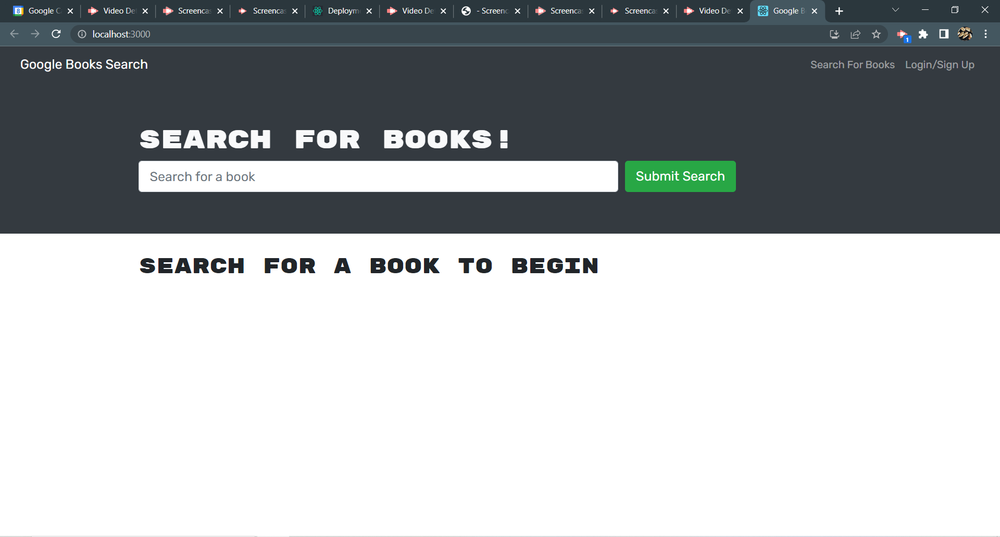

# Book Search Engine

## Description
A book search engine that has been refracted from a RESTful API to a GraphQL API built with Apollo Server    

 ## Table of Contents:

  **[How to Use](#how-to-use)**  
  **[Application Demos](#application-demos)**  
  **[Link to Deployed Page](#link-to-deployed-page)**  
  **[References](#references)**  
  **[Devlopment Process](#development-process)**  
  **[Author](#author)**  

## How to Use:
* Enter your search into the search bar to find books and their related information  
* Login or create and account to save or remove books  

## Application Demos:
<h2 align="center">Book Search Engine!</h2>

   
<h2 align="center">Removing saved books</h2>

  
<h2 align="center">Refractored Code</h2>

  

<a href="https://drive.google.com/file/d/1377GXpEymlauFKofHzWeFhWZrjOm987q/view">Video Demo</a>

## Link to Deployed Page:
https://timzebrabooksearchengine.herokuapp.com/

## References:
* UTA Bootcamp Topic #21 MERN

## Development Process:
1. Reviewed and tested RESTful API code  
2. Created list of actions needing to be refractored  
3. Refractored server and database  
4. Refractored routes  
5. Debugged  
6. Refractored middleware  
7. See commits for more details

## Author:
Created by Timothy Zalewski | Deployed on [GitHub](https://github.com/Tim-Zebra)